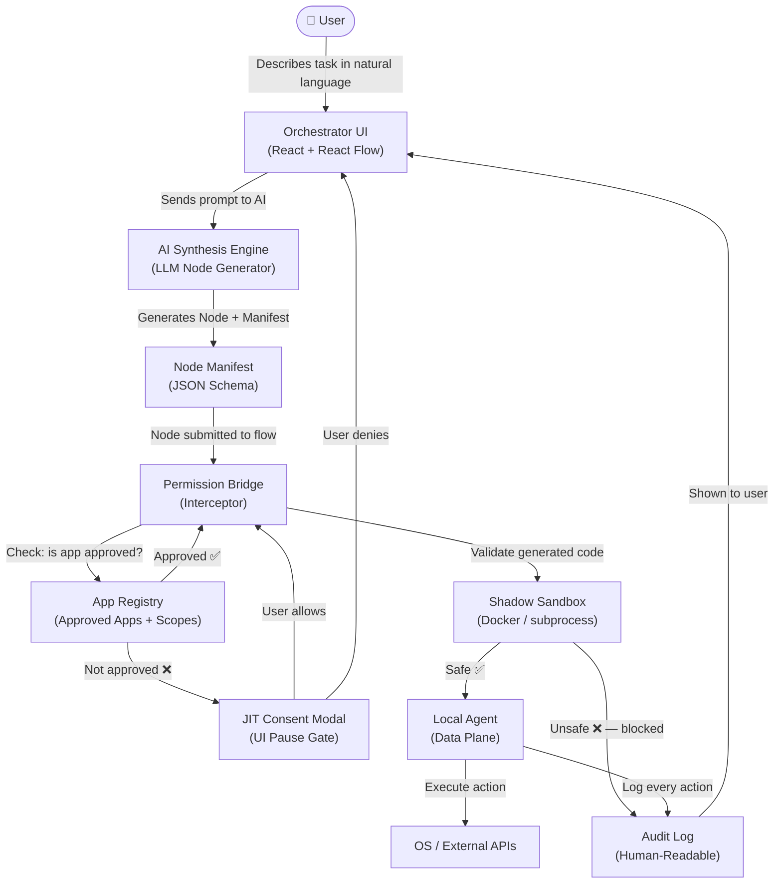

# Xoltra Permission Bridge — Architecture

## System Data Flow

## Three-Tier Summary

| Tier | Name | Responsibility |
|------|------|----------------|
| 1 | Orchestrator (Control Plane) | UI, flow state, node connections, triggers |
| 2 | Permission Bridge (Security Plane) | Manifest checks, JIT consent, sandbox validation |
| 3 | Local Agent (Data Plane) | OS-level execution, API calls, audit logging |

## Key Security Principles

- **Zero Trust** — no node is trusted by default, every action is checked
- **Manifest-First** — nodes must declare what they need before they can run
- **JIT Consent** — permission is granted per-action, not per-session
- **Sandbox Validation** — AI-generated code is tested in isolation before touching real data
- **Audit Everything** — every action is logged in plain English for the user
